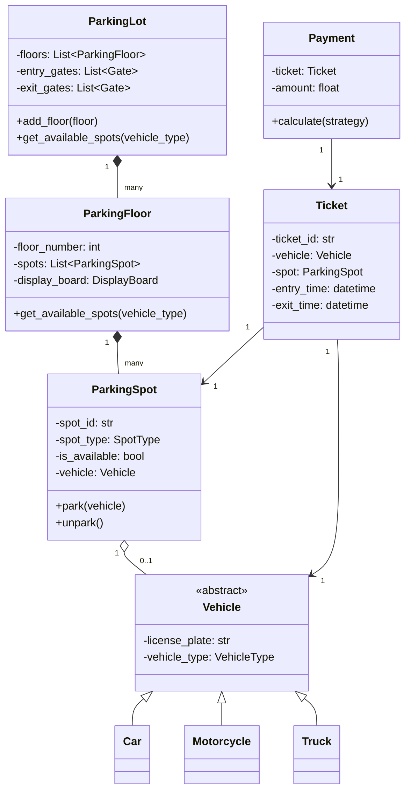

# 🅿️ Parking Lot System — Problem Statement

## Category: Access Control / Multi-tenancy
**Difficulty**: Medium | **Time**: 45 min | **Week**: 1

---

## Problem Statement

Design an object-oriented parking lot system that supports:

1. **Multi-floor parking** with configurable spots per floor
2. **Multiple vehicle types**: Motorcycle, Car, Truck (each needs different spot sizes)
3. **Spot allocation**: Assign the nearest available spot to the entry point
4. **Entry/Exit gates**: Track vehicles entering and leaving
5. **Payment**: Calculate fees based on duration (hourly rates differ by vehicle type)
6. **Display board**: Show available spots count per floor per vehicle type

---

## Requirements Gathering (Practice Questions)

Ask these before designing:

1. How many floors and spots per floor?
2. What vehicle types do we support?
3. Can a truck take multiple spots?
4. Is there a flat rate or hourly rate?
5. Do we need multiple entry/exit points?
6. Should the system handle concurrent entry/exit?
7. Do we need reservation support?
8. Is there a monthly/subscription model?

---

## Core Entities

| Entity | Responsibility |
|--------|---------------|
| `ParkingLot` | Top-level container, manages floors |
| `ParkingFloor` | Contains spots, tracks availability |
| `ParkingSpot` | Individual spot with type and status |
| `Vehicle` | Abstract base — Car, Motorcycle, Truck |
| `Ticket` | Issued on entry, tracks time and spot |
| `Payment` | Calculates fee based on duration |
| `EntryGate` / `ExitGate` | Handles vehicle flow |
| `DisplayBoard` | Shows real-time availability |

---

## Key Design Decisions

### 1. Vehicle-Spot Mapping
```
Motorcycle → Small Spot
Car        → Medium Spot  
Truck      → Large Spot (or multiple medium spots)
```

### 2. Spot Allocation Strategy (Strategy Pattern)
```python
class SpotAllocationStrategy(ABC):
    @abstractmethod
    def find_spot(self, vehicle: Vehicle, floors: List[ParkingFloor]) -> ParkingSpot:
        pass

class NearestSpotStrategy(SpotAllocationStrategy):
    """Finds the nearest available spot to entry"""
    pass

class FirstAvailableStrategy(SpotAllocationStrategy):
    """Finds the first available spot (any floor)"""
    pass
```

### 3. Payment Strategy (Strategy Pattern)
```python
class PricingStrategy(ABC):
    @abstractmethod
    def calculate_fee(self, ticket: Ticket) -> float:
        pass

class HourlyPricing(PricingStrategy):
    pass

class FlatRatePricing(PricingStrategy):
    pass
```

### 4. Observer Pattern — Display Board
- When a spot is occupied/freed, notify the `DisplayBoard`
- DisplayBoard updates available counts

---

## Class Diagram (Mermaid)



---

## Variations This Unlocks

| Variation | What Changes |
|-----------|-------------|
| **Library Management** | Books instead of cars, borrowing instead of parking, due dates instead of hourly rate |
| **ATM Machine** | Single "spot" (cash dispenser), state machine for transactions |
| **Splitwise** | Payment calculation strategy becomes expense splitting strategy |
| **Gym Locker System** | Lockers instead of spots, members instead of vehicles |

---

## Interview Checklist

- [ ] Clarified requirements (5 min)
- [ ] Identified core entities (3 min)
- [ ] Drew class diagram (5 min)
- [ ] Implemented Vehicle hierarchy with Factory
- [ ] Implemented Spot allocation with Strategy
- [ ] Implemented Payment with Strategy
- [ ] Implemented DisplayBoard with Observer
- [ ] Handled concurrent access (thread safety)
- [ ] Discussed extensibility
