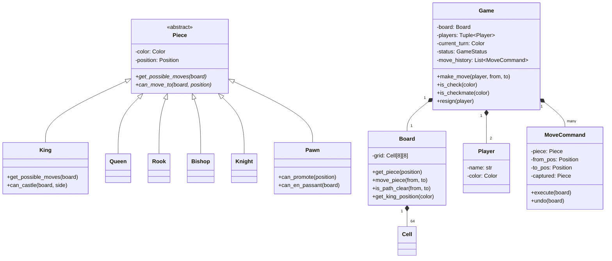

# ♟️ Chess Game — Problem Statement

## Category: Game Design
**Difficulty**: Hard | **Time**: 45 min | **Week**: 2

---

## Problem Statement

Design an object-oriented chess game that supports:

1. **Standard 8×8 board** with proper piece placement
2. **All 6 piece types**: King, Queen, Rook, Bishop, Knight, Pawn (each with unique move rules)
3. **Turn-based play** between two players (White and Black)
4. **Move validation**: Only allow legal moves per piece rules
5. **Check and Checkmate detection**
6. **Special moves**: Castling, En Passant, Pawn Promotion
7. **Game end conditions**: Checkmate, Stalemate, Resign, Draw

---

## Requirements Gathering (Practice Questions)

1. Are we building a 2-player local game or online?
2. Do we need a timer (blitz, rapid)?
3. Should we support undo/redo?
4. Do we need to persist game state?
5. Should we track move history (PGN notation)?
6. Do we need an AI opponent?

---

## Core Entities

| Entity | Responsibility |
|--------|---------------|
| `Game` | Orchestrates the game lifecycle |
| `Board` | 8×8 grid, manages piece positions |
| `Cell/Square` | Single position on the board |
| `Piece` | Abstract base for all pieces |
| `King`, `Queen`, `Rook`, `Bishop`, `Knight`, `Pawn` | Concrete pieces with move logic |
| `Player` | Represents a player (color, pieces) |
| `Move` | Encapsulates a move (from, to, piece, captured) |
| `GameStatus` | Enum: Active, Check, Checkmate, Stalemate, Resigned |

---

## Key Design Decisions

### 1. Piece Hierarchy (Polymorphism)
```python
class Piece(ABC):
    def __init__(self, color: Color, position: Position):
        self.color = color
        self.position = position
    
    @abstractmethod
    def get_possible_moves(self, board: Board) -> List[Position]:
        """Each piece implements its own movement rules"""
        pass
    
    @abstractmethod
    def get_symbol(self) -> str:
        pass

class Knight(Piece):
    def get_possible_moves(self, board: Board) -> List[Position]:
        """L-shaped moves: 2+1 in any direction"""
        pass

class Bishop(Piece):
    def get_possible_moves(self, board: Board) -> List[Position]:
        """Diagonal moves until blocked"""
        pass
```

### 2. Move Validation (Template Method)
```python
class Game:
    def make_move(self, player: Player, from_pos: Position, to_pos: Position) -> bool:
        # 1. Validate it's the player's turn
        # 2. Validate piece belongs to player
        # 3. Validate move is in piece's possible moves
        # 4. Validate move doesn't put own king in check
        # 5. Execute move
        # 6. Check for check/checkmate/stalemate
        # 7. Switch turn
        pass
```

### 3. Command Pattern (Undo/Redo)
```python
class MoveCommand:
    def __init__(self, piece, from_pos, to_pos, captured_piece=None):
        self.piece = piece
        self.from_pos = from_pos
        self.to_pos = to_pos
        self.captured_piece = captured_piece
    
    def execute(self, board: Board):
        """Move piece from from_pos to to_pos"""
        pass
    
    def undo(self, board: Board):
        """Reverse the move"""
        pass
```

### 4. Board Representation
```python
class Board:
    def __init__(self):
        self.grid: List[List[Cell]] = [[Cell(r, c) for c in range(8)] for r in range(8)]
    
    def get_piece(self, position: Position) -> Optional[Piece]:
        pass
    
    def move_piece(self, from_pos: Position, to_pos: Position):
        pass
    
    def is_path_clear(self, from_pos: Position, to_pos: Position) -> bool:
        """Check if no pieces block the path (for Rook, Bishop, Queen)"""
        pass
```

---

## Class Diagram (Mermaid)



---

## Variations This Unlocks

| Variation | What Changes |
|-----------|-------------|
| **Tic-Tac-Toe** | 3×3 board, 1 piece type, simpler win condition |
| **Snakes & Ladders** | Linear board, dice-based movement, no attack |
| **Checkers** | 8×8 board, 1 piece type with promotion, diagonal only |
| **Card Game (UNO)** | Hand instead of board, card instead of piece, matching rules |
| **Ludo** | Circular board, dice, multiple pieces per player |

---

## Interview Checklist

- [ ] Clarified requirements (5 min)
- [ ] Identified entities (Piece hierarchy is key)
- [ ] Drew class diagram with piece inheritance
- [ ] Implemented Piece base class with abstract `get_possible_moves`
- [ ] Implemented at least 3 piece types (Knight, Pawn, Rook)
- [ ] Implemented Board with move validation
- [ ] Implemented check detection
- [ ] Discussed checkmate algorithm
- [ ] Discussed Command pattern for undo
- [ ] Discussed extensibility (adding fairy chess pieces)
