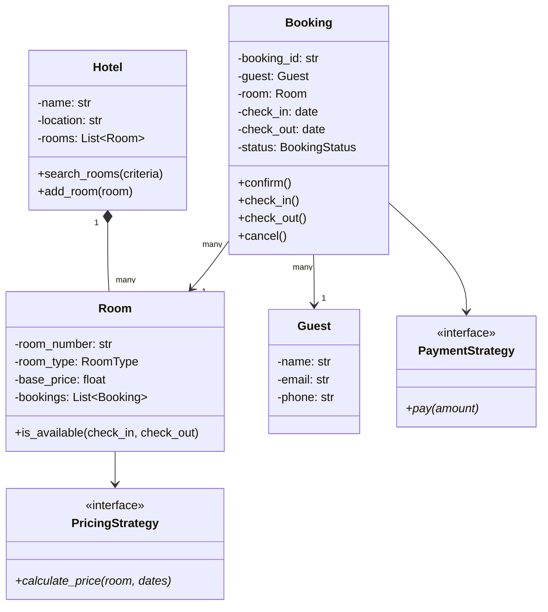

# 🏨 Hotel Booking System — Problem Statement

## Category: Booking / Reservation Systems
**Difficulty**: Medium | **Time**: 45 min | **Week**: 3

---

## Problem Statement

Design an object-oriented hotel booking system that supports:

1. **Hotel management**: Multiple hotels with multiple room types
2. **Room types**: Single, Double, Suite, Deluxe (different capacity & pricing)
3. **Search**: Find available rooms by date range, location, room type, price range
4. **Booking**: Reserve rooms with check-in/check-out dates
5. **Booking lifecycle**: Pending → Confirmed → CheckedIn → CheckedOut → Cancelled
6. **Payment**: Multiple payment methods (Credit Card, UPI, Wallet)
7. **Concurrency**: Handle double-booking prevention
8. **Notifications**: Send booking confirmation, check-in reminders

---

## Requirements Gathering (Practice Questions)

1. Single hotel or multi-hotel chain?
2. Can a booking have multiple rooms?
3. Do we need seasonal/dynamic pricing?
4. Is cancellation free or with penalty?
5. Do we need guest reviews/ratings?
6. Should we handle overbooking (like airlines)?
7. Do rooms have amenities (WiFi, AC, TV)?
8. Do we need a loyalty/rewards program?

---

## Core Entities

| Entity | Responsibility |
|--------|---------------|
| `Hotel` | Contains rooms, location, amenities |
| `Room` | Physical room with type and status |
| `RoomType` | Enum: Single, Double, Suite, Deluxe |
| `Guest` | User making the booking |
| `Booking` | Reservation linking guest to room(s) with dates |
| `BookingStatus` | State machine: Pending → Confirmed → CheckedIn → CheckedOut |
| `Payment` | Handles transaction with strategy for payment methods |
| `SearchService` | Filters available rooms by criteria |
| `NotificationService` | Sends emails/SMS on booking events |

---

## Key Design Decisions

### 1. Room Availability Check
```python
class Room:
    def is_available(self, check_in: date, check_out: date) -> bool:
        """Check if room has no overlapping bookings"""
        for booking in self.bookings:
            if booking.status in (BookingStatus.CONFIRMED, BookingStatus.CHECKED_IN):
                if not (check_out <= booking.check_in or check_in >= booking.check_out):
                    return False  # Overlap found
        return True
```

### 2. Booking State Machine (State Pattern)
```python
class BookingStatus(Enum):
    PENDING = "pending"
    CONFIRMED = "confirmed"
    CHECKED_IN = "checked_in"
    CHECKED_OUT = "checked_out"
    CANCELLED = "cancelled"

# Valid transitions:
# PENDING → CONFIRMED, CANCELLED
# CONFIRMED → CHECKED_IN, CANCELLED
# CHECKED_IN → CHECKED_OUT
# CHECKED_OUT → (terminal)
# CANCELLED → (terminal)
```

### 3. Payment Strategy
```python
class PaymentStrategy(ABC):
    @abstractmethod
    def pay(self, amount: float) -> bool:
        pass

class CreditCardPayment(PaymentStrategy):
    pass

class UPIPayment(PaymentStrategy):
    pass

class WalletPayment(PaymentStrategy):
    pass
```

### 4. Pricing Strategy
```python
class PricingStrategy(ABC):
    @abstractmethod
    def calculate_price(self, room: Room, check_in: date, check_out: date) -> float:
        pass

class StandardPricing(PricingStrategy):
    """Base rate × number of nights"""
    pass

class SeasonalPricing(PricingStrategy):
    """Higher rates during peak season"""
    pass

class DynamicPricing(PricingStrategy):
    """Price based on occupancy percentage"""
    pass
```

### 5. Observer Pattern — Notifications
```python
class BookingObserver(ABC):
    @abstractmethod
    def on_booking_event(self, booking: Booking, event: str):
        pass

class EmailNotifier(BookingObserver):
    def on_booking_event(self, booking, event):
        if event == "CONFIRMED":
            send_email(booking.guest.email, "Booking Confirmed!")
        elif event == "CANCELLED":
            send_email(booking.guest.email, "Booking Cancelled")

class SMSNotifier(BookingObserver):
    pass
```

### 6. Concurrency — Double Booking Prevention
```python
import threading

class BookingService:
    _lock = threading.Lock()
    
    def create_booking(self, guest, room, check_in, check_out):
        with self._lock:
            if room.is_available(check_in, check_out):
                booking = Booking(guest, room, check_in, check_out)
                room.add_booking(booking)
                return booking
            raise RoomNotAvailableError("Room already booked")
```

---

## Class Diagram (Mermaid)



---

## Variations This Unlocks

| Variation | What Changes |
|-----------|-------------|
| **Movie Ticket Booking** | Rooms → Seats, Hotels → Theaters, Dates → Showtimes |
| **Meeting Room Scheduler** | Hotels → Office buildings, Guests → Employees, hourly slots |
| **Flight Booking** | Rooms → Seats on plane, Hotels → Airlines, Dates → Flight times |
| **Restaurant Reservation** | Rooms → Tables, time slots instead of date ranges |
| **Doctor Appointment** | Rooms → Time slots, Hotels → Clinics, Guests → Patients |

---

## Interview Checklist

- [ ] Clarified requirements (5 min)
- [ ] Identified core entities
- [ ] Drew class diagram
- [ ] Implemented Room availability check (date overlap logic)
- [ ] Implemented Booking state machine
- [ ] Implemented Payment with Strategy pattern
- [ ] Implemented Pricing with Strategy pattern
- [ ] Implemented Observer for notifications
- [ ] Discussed concurrency for double-booking
- [ ] Discussed search/filter extensibility
