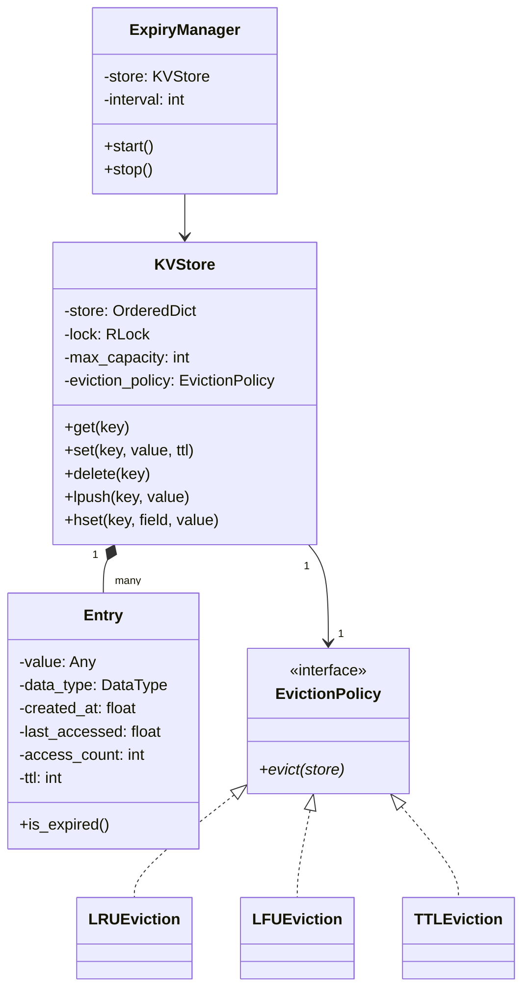

# 🗄️ In-Memory Key-Value Store — Problem Statement

## Category: Storage / Infrastructure Systems
**Difficulty**: Hard | **Time**: 45 min | **Week**: 4

---

## Problem Statement

Design an in-memory key-value store (like Redis) that supports:

1. **Basic operations**: GET, SET, DELETE
2. **TTL (Time-To-Live)**: Keys auto-expire after a set duration
3. **Multiple data types**: String, List, HashMap
4. **Eviction policies**: LRU, LFU, TTL-based eviction when memory is full
5. **Thread safety**: Concurrent reads and writes
6. **Persistence**: Optional snapshotting to disk

---

## Requirements Gathering (Practice Questions)

1. What data types do we support?
2. What's the max memory capacity?
3. Which eviction policy is default?
4. Do we need pub/sub?
5. Do we need transactions (MULTI/EXEC)?
6. Single-threaded or multi-threaded?
7. Do we need persistence? Snapshotting or append-only log?

---

## Core Entities

| Entity | Responsibility |
|--------|---------------|
| `KVStore` | Main interface — orchestrates all operations |
| `DataStore` | Underlying HashMap for key-value storage |
| `Entry` | Wraps value with metadata (TTL, access time, frequency) |
| `EvictionPolicy` | Strategy for evicting keys (LRU, LFU, FIFO) |
| `ExpiryManager` | Background thread to clean expired keys |
| `PersistenceManager` | Handles snapshotting and recovery |
| `TypeHandler` | Handles operations for specific data types |

---

## Key Design Decisions

### 1. Entry Wrapper
```python
@dataclass
class Entry:
    value: Any
    data_type: DataType  # STRING, LIST, HASHMAP
    created_at: float
    last_accessed: float
    access_count: int = 0
    ttl: Optional[int] = None  # seconds
    
    def is_expired(self) -> bool:
        if self.ttl is None:
            return False
        return time.time() - self.created_at > self.ttl
```

### 2. Eviction Strategy Pattern
```python
class EvictionPolicy(ABC):
    @abstractmethod
    def evict(self, store: Dict[str, Entry]) -> str:
        """Return the key to evict"""
        pass

class LRUEviction(EvictionPolicy):
    """Evict least recently used — uses OrderedDict or doubly-linked list"""
    def evict(self, store):
        return min(store, key=lambda k: store[k].last_accessed)

class LFUEviction(EvictionPolicy):
    """Evict least frequently used"""
    def evict(self, store):
        return min(store, key=lambda k: store[k].access_count)

class TTLEviction(EvictionPolicy):
    """Evict the key closest to expiry"""
    def evict(self, store):
        expiring = {k: v for k, v in store.items() if v.ttl is not None}
        return min(expiring, key=lambda k: expiring[k].created_at + expiring[k].ttl)
```

### 3. Thread Safety
```python
import threading
from collections import OrderedDict

class KVStore:
    def __init__(self, max_capacity: int, eviction_policy: EvictionPolicy):
        self._store: OrderedDict[str, Entry] = OrderedDict()
        self._lock = threading.RLock()
        self._max_capacity = max_capacity
        self._eviction_policy = eviction_policy
    
    def get(self, key: str) -> Any:
        with self._lock:
            entry = self._store.get(key)
            if entry is None or entry.is_expired():
                if entry and entry.is_expired():
                    del self._store[key]
                return None
            entry.last_accessed = time.time()
            entry.access_count += 1
            self._store.move_to_end(key)  # LRU tracking
            return entry.value
    
    def set(self, key: str, value: Any, ttl: Optional[int] = None):
        with self._lock:
            if key not in self._store and len(self._store) >= self._max_capacity:
                evict_key = self._eviction_policy.evict(self._store)
                del self._store[evict_key]
            self._store[key] = Entry(
                value=value, data_type=self._detect_type(value),
                created_at=time.time(), last_accessed=time.time(), ttl=ttl
            )
    
    def delete(self, key: str) -> bool:
        with self._lock:
            if key in self._store:
                del self._store[key]
                return True
            return False
```

### 4. Background Expiry Cleanup
```python
class ExpiryManager:
    def __init__(self, store: KVStore, interval: int = 1):
        self._store = store
        self._interval = interval
        self._running = False
    
    def start(self):
        self._running = True
        thread = threading.Thread(target=self._cleanup_loop, daemon=True)
        thread.start()
    
    def _cleanup_loop(self):
        while self._running:
            self._store.cleanup_expired()
            time.sleep(self._interval)
```

### 5. Data Type Operations (Decorator/Strategy)
```python
class KVStore:
    # List operations
    def lpush(self, key: str, value: Any):
        with self._lock:
            entry = self._store.get(key)
            if entry is None:
                entry = Entry(value=[], data_type=DataType.LIST, ...)
                self._store[key] = entry
            if entry.data_type != DataType.LIST:
                raise TypeError("Key is not a list")
            entry.value.insert(0, value)
    
    # HashMap operations
    def hset(self, key: str, field: str, value: Any):
        with self._lock:
            entry = self._store.get(key)
            if entry is None:
                entry = Entry(value={}, data_type=DataType.HASHMAP, ...)
                self._store[key] = entry
            entry.value[field] = value
```

---

## Class Diagram (Mermaid)



---

## Variations This Unlocks

| Variation | What Changes |
|-----------|-------------|
| **LRU/LFU Cache** | KV store with fixed eviction policy, no TTL |
| **Rate Limiter** | KV store where values are counters with TTL |
| **In-Memory File System** | KV store with tree-structured keys (paths) |
| **Logger Framework** | KV store with append-only writes and log levels |
| **Session Store** | KV store with TTL for session expiry |

---

## Interview Checklist

- [ ] Clarified requirements (data types, eviction, threading)
- [ ] Designed Entry wrapper with metadata
- [ ] Implemented GET/SET/DELETE with thread safety
- [ ] Implemented eviction with Strategy pattern
- [ ] Implemented TTL with background cleanup
- [ ] Discussed LRU implementation (OrderedDict / DLL + HashMap)
- [ ] Discussed persistence strategies
- [ ] Discussed data type operations
