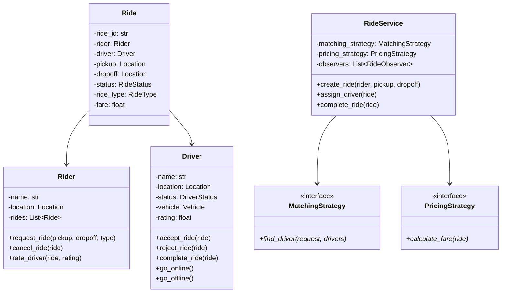

# 🚕 Cab Booking System (Uber/Ola) — Problem Statement

## Category: Ride-Sharing / Matching Systems
**Difficulty**: Hard | **Time**: 45 min | **Week**: 5

---

## Problem Statement

Design an object-oriented cab booking system that supports:

1. **Rider operations**: Request ride, cancel ride, rate driver
2. **Driver operations**: Accept/reject ride, go online/offline, complete ride
3. **Matching**: Match nearest available driver to rider
4. **Ride lifecycle**: Requested → DriverAssigned → InProgress → Completed → Rated
5. **Pricing**: Distance-based pricing with surge multiplier
6. **Ride types**: Mini, Sedan, SUV (different pricing, different driver pools)
7. **Real-time tracking**: Track driver location

---

## Requirements Gathering (Practice Questions)

1. How is driver-rider matching done? Nearest? Rating-based?
2. What ride types do we support?
3. How does surge pricing work?
4. Can a rider cancel after driver is assigned? Cancellation fee?
5. Do drivers set their own availability?
6. Do we need ride-sharing (pool)?
7. How do we handle payment (cash/card/wallet)?
8. Do we need estimated time of arrival (ETA)?

---

## Core Entities

| Entity | Responsibility |
|--------|---------------|
| `Rider` | Requests rides, rates drivers |
| `Driver` | Accepts rides, has location and status |
| `Ride` | Links rider to driver with route and pricing |
| `RideStatus` | State machine: Requested → Assigned → InProgress → Completed |
| `Location` | Lat/Long coordinates |
| `RideType` | Enum: Mini, Sedan, SUV |
| `PricingStrategy` | Calculates fare (base + distance + surge) |
| `MatchingStrategy` | Finds best driver for a ride request |
| `RideService` | Orchestrates ride lifecycle |
| `NotificationService` | Notifies rider/driver of ride events |

---

## Key Design Decisions

### 1. Ride State Machine (State Pattern)
```python
class RideStatus(Enum):
    REQUESTED = "requested"
    DRIVER_ASSIGNED = "driver_assigned"
    IN_PROGRESS = "in_progress"
    COMPLETED = "completed"
    CANCELLED = "cancelled"

# Valid transitions:
# REQUESTED → DRIVER_ASSIGNED, CANCELLED
# DRIVER_ASSIGNED → IN_PROGRESS, CANCELLED
# IN_PROGRESS → COMPLETED
```

### 2. Driver Matching Strategy
```python
class MatchingStrategy(ABC):
    @abstractmethod
    def find_driver(self, ride_request: RideRequest, 
                    available_drivers: List[Driver]) -> Optional[Driver]:
        pass

class NearestDriverStrategy(MatchingStrategy):
    def find_driver(self, ride_request, available_drivers):
        pickup = ride_request.pickup_location
        return min(available_drivers, 
                   key=lambda d: d.location.distance_to(pickup))

class HighestRatedStrategy(MatchingStrategy):
    def find_driver(self, ride_request, available_drivers):
        return max(available_drivers, key=lambda d: d.rating)

class BestMatchStrategy(MatchingStrategy):
    """Weighted: 70% proximity + 30% rating"""
    pass
```

### 3. Pricing Strategy
```python
class PricingStrategy(ABC):
    @abstractmethod
    def calculate_fare(self, ride: Ride) -> float:
        pass

class StandardPricing(PricingStrategy):
    def __init__(self, base_fare: float, per_km: float, per_min: float):
        self.base_fare = base_fare
        self.per_km = per_km
        self.per_min = per_min
    
    def calculate_fare(self, ride: Ride) -> float:
        distance = ride.pickup.distance_to(ride.dropoff)
        duration = ride.duration_minutes
        return self.base_fare + (self.per_km * distance) + (self.per_min * duration)

class SurgePricing(PricingStrategy):
    """Wraps another strategy with a surge multiplier (Decorator!)"""
    def __init__(self, base_strategy: PricingStrategy, surge_multiplier: float):
        self.base_strategy = base_strategy
        self.surge_multiplier = surge_multiplier
    
    def calculate_fare(self, ride: Ride) -> float:
        return self.base_strategy.calculate_fare(ride) * self.surge_multiplier
```

### 4. Location & Distance
```python
@dataclass
class Location:
    latitude: float
    longitude: float
    
    def distance_to(self, other: 'Location') -> float:
        """Haversine formula for distance in km"""
        # Simplified: Euclidean for LLD purposes
        return ((self.latitude - other.latitude)**2 + 
                (self.longitude - other.longitude)**2) ** 0.5
```

### 5. Observer — Notifications
```python
class RideObserver(ABC):
    @abstractmethod
    def on_ride_event(self, ride: Ride, event: str):
        pass

class RiderNotifier(RideObserver):
    def on_ride_event(self, ride, event):
        if event == "DRIVER_ASSIGNED":
            notify(ride.rider, f"Driver {ride.driver.name} is on the way!")
        elif event == "COMPLETED":
            notify(ride.rider, f"Ride completed. Fare: ₹{ride.fare}")

class DriverNotifier(RideObserver):
    def on_ride_event(self, ride, event):
        if event == "REQUESTED":
            notify(ride.driver, "New ride request!")
```

---

## Class Diagram (Mermaid)



---

## Variations This Unlocks

| Variation | What Changes |
|-----------|-------------|
| **Food Delivery** | Add Restaurant + Menu entities, driver becomes delivery partner, matching considers restaurant location |
| **Package Delivery** | No rider in vehicle, pickup from warehouse, delivery to address |
| **Ambulance Dispatch** | Priority-based matching, no pricing per se, emergency routing |

---

## Interview Checklist

- [ ] Clarified requirements
- [ ] Designed ride state machine
- [ ] Implemented driver matching with Strategy
- [ ] Implemented pricing with Strategy (including surge as Decorator)
- [ ] Implemented Observer for notifications
- [ ] Handled driver status management (online/offline/on-ride)
- [ ] Discussed concurrency (two riders requesting same driver)
- [ ] Discussed extensibility (adding ride pools)
