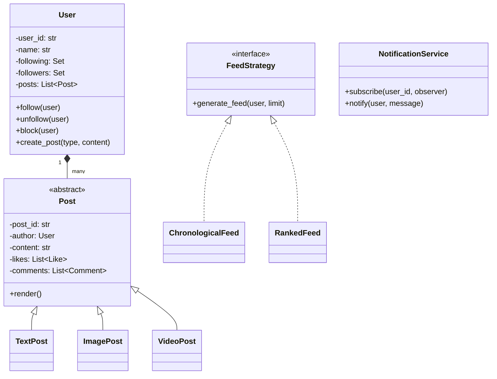

# 🐦 Social Media Platform (Twitter) — Problem Statement

## Category: Social / Content Platforms
**Difficulty**: Hard | **Time**: 45 min | **Week**: 8

---

## Problem Statement

Design an object-oriented social media platform that supports:

1. **User management**: Register, login, profile (bio, avatar)
2. **Social graph**: Follow/unfollow, block users
3. **Post creation**: Text, image, video posts
4. **Feed generation**: Timeline showing posts from followed users
5. **Interactions**: Like, comment, repost/retweet, share
6. **Notifications**: Notify on follow, like, comment, mention
7. **Search**: Search users, posts, hashtags

---

## Requirements Gathering (Practice Questions)

1. Is the feed chronological or algorithmic (ranked)?
2. Do we support stories (ephemeral content)?
3. Can users send DMs (direct messages)?
4. Do we need hashtag trending?
5. Is content moderation in scope?
6. Do we need post privacy (public/private/friends-only)?
7. Can users create groups or communities?

---

## Core Entities

| Entity | Responsibility |
|--------|---------------|
| `User` | Profile, settings, social graph |
| `Post` | Content unit — abstract base |
| `TextPost`, `ImagePost`, `VideoPost` | Concrete post types |
| `Comment` | Response to a post |
| `Like` | Interaction record |
| `Feed` | Generates timeline for a user |
| `FeedStrategy` | Algorithm for feed ranking |
| `NotificationService` | Dispatches notifications |
| `Notification` | Individual notification entity |
| `SearchService` | Handles user/post/hashtag search |

---

## Key Design Decisions

### 1. Post Hierarchy (Factory Pattern)
```python
class Post(ABC):
    def __init__(self, author: User, content: str):
        self.post_id = str(uuid4())
        self.author = author
        self.content = content
        self.created_at = datetime.now()
        self.likes: List[Like] = []
        self.comments: List[Comment] = []
        self.visibility: Visibility = Visibility.PUBLIC
    
    @abstractmethod
    def render(self) -> dict:
        pass

class TextPost(Post):
    def render(self) -> dict:
        return {"type": "text", "content": self.content}

class ImagePost(Post):
    def __init__(self, author: User, content: str, image_url: str):
        super().__init__(author, content)
        self.image_url = image_url

class VideoPost(Post):
    def __init__(self, author: User, content: str, video_url: str):
        super().__init__(author, content)
        self.video_url = video_url

class PostFactory:
    @staticmethod
    def create_post(post_type: str, author: User, content: str, 
                    media_url: str = None) -> Post:
        if post_type == "text":
            return TextPost(author, content)
        elif post_type == "image":
            return ImagePost(author, content, media_url)
        elif post_type == "video":
            return VideoPost(author, content, media_url)
        raise ValueError(f"Unknown post type: {post_type}")
```

### 2. Social Graph
```python
class User:
    def __init__(self, user_id: str, name: str, email: str):
        self.user_id = user_id
        self.name = name
        self.email = email
        self.following: Set[str] = set()   # user_ids
        self.followers: Set[str] = set()   # user_ids
        self.blocked: Set[str] = set()     # user_ids
        self.posts: List[Post] = []
    
    def follow(self, other: 'User'):
        if other.user_id in self.blocked:
            raise ValueError("Cannot follow blocked user")
        self.following.add(other.user_id)
        other.followers.add(self.user_id)
    
    def unfollow(self, other: 'User'):
        self.following.discard(other.user_id)
        other.followers.discard(self.user_id)
    
    def block(self, other: 'User'):
        self.blocked.add(other.user_id)
        self.unfollow(other)
        other.unfollow(self)
```

### 3. Feed Generation (Strategy Pattern)
```python
class FeedStrategy(ABC):
    @abstractmethod
    def generate_feed(self, user: User, all_users: Dict[str, User], 
                      limit: int = 20) -> List[Post]:
        pass

class ChronologicalFeed(FeedStrategy):
    def generate_feed(self, user, all_users, limit=20):
        posts = []
        for uid in user.following:
            followed_user = all_users[uid]
            posts.extend(followed_user.posts)
        posts.sort(key=lambda p: p.created_at, reverse=True)
        return posts[:limit]

class RankedFeed(FeedStrategy):
    def generate_feed(self, user, all_users, limit=20):
        posts = []
        for uid in user.following:
            followed_user = all_users[uid]
            posts.extend(followed_user.posts)
        # Rank by engagement score
        posts.sort(key=lambda p: self._engagement_score(p), reverse=True)
        return posts[:limit]
    
    def _engagement_score(self, post: Post) -> float:
        recency = 1.0 / (1 + (time.time() - post.created_at.timestamp()) / 3600)
        engagement = len(post.likes) * 1.0 + len(post.comments) * 2.0
        return recency * 0.4 + engagement * 0.6
```

### 4. Interactions
```python
class InteractionService:
    def __init__(self, notification_service: NotificationService):
        self._notification_service = notification_service
    
    def like_post(self, user: User, post: Post):
        like = Like(user_id=user.user_id, post_id=post.post_id)
        post.likes.append(like)
        self._notification_service.notify(
            post.author, f"{user.name} liked your post"
        )
    
    def comment_on_post(self, user: User, post: Post, text: str):
        comment = Comment(author=user, text=text)
        post.comments.append(comment)
        self._notification_service.notify(
            post.author, f"{user.name} commented: {text[:50]}"
        )
    
    def repost(self, user: User, original_post: Post) -> Post:
        repost = Repost(author=user, original=original_post)
        user.posts.append(repost)
        self._notification_service.notify(
            original_post.author, f"{user.name} reposted your post"
        )
        return repost
```

### 5. Notification with Observer
```python
class NotificationService:
    def __init__(self):
        self._observers: Dict[str, List[NotificationObserver]] = {}
    
    def subscribe(self, user_id: str, observer: NotificationObserver):
        self._observers.setdefault(user_id, []).append(observer)
    
    def notify(self, user: User, message: str):
        notification = Notification(
            user_id=user.user_id,
            message=message,
            timestamp=datetime.now(),
            read=False
        )
        for observer in self._observers.get(user.user_id, []):
            observer.on_notification(notification)

class PushNotificationObserver(NotificationObserver):
    def on_notification(self, notification):
        send_push(notification.user_id, notification.message)

class EmailNotificationObserver(NotificationObserver):
    def on_notification(self, notification):
        send_email(notification.user_id, notification.message)
```

---

## Class Diagram (Mermaid)



---

## Variations This Unlocks

| Variation | What Changes |
|-----------|-------------|
| **Chat App** | Posts → Messages, Feed → Conversation, real-time delivery |
| **Q&A Platform (StackOverflow)** | Posts → Questions/Answers, Likes → Votes (up/down), reputation system |
| **Notification System** | Extract notification service as standalone system |
| **Content Moderation** | Add moderation pipeline before post publishing |
| **Reddit** | Posts + Subreddits (communities), upvote/downvote ranking |

---

## Interview Checklist

- [ ] Clarified requirements (feed type, features scope)
- [ ] Designed User with social graph (follow/unfollow/block)
- [ ] Implemented Post hierarchy with Factory pattern
- [ ] Implemented Feed generation with Strategy pattern
- [ ] Implemented interactions (like, comment, repost)
- [ ] Implemented Notification with Observer pattern
- [ ] Discussed feed ranking algorithm
- [ ] Discussed privacy/visibility (public, private, friends-only)
- [ ] Discussed scalability (fan-out on write vs read)
