# Library Management System

A modular Python implementation covering books, members, borrow/return lifecycle, fines, and real-time waitlist notification.

---

## UML Class Diagram

```mermaid
classDiagram

    %% ───────────────────────────────────────────────
    %% ENUMS
    %% ───────────────────────────────────────────────

    class Genre {
        <<enumeration>>
        FICTION
        NON_FICTION
        SCIENCE
        TECHNOLOGY
        HISTORY
        BIOGRAPHY
        SELF_HELP
        OTHER
    }

    class BookCopyStatus {
        <<enumeration>>
        AVAILABLE
        BORROWED
        RESERVED
        LOST
    }

    class MemberType {
        <<enumeration>>
        STUDENT
        TEACHER
        PREMIUM
    }

    %% ───────────────────────────────────────────────
    %% MODELS
    %% ───────────────────────────────────────────────

    class Book {
        +str isbn
        +str title
        +str author
        +Genre genre
        -list~BookCopy~ _copies
        +add_copy() BookCopy
        +available_copies() list~BookCopy~
        +total_copies() int
        +get_copy(copy_id) BookCopy
        +copy_summary() dict
    }

    class BookCopy {
        +str copy_id
        +str isbn
        -BookCopyStatus _status
        +is_available() bool
        +status() BookCopyStatus
        +transition(new_status) void
    }

    class MemberPolicy {
        <<NamedTuple>>
        +int max_books
        +int loan_days
        +int fine_waiver_days
    }

    class Member {
        +str member_id
        +str name
        +str email
        +MemberType member_type
        +MemberPolicy policy
        +list~str~ active_loan_ids
        +can_borrow() bool
        +active_loans_count() int
    }

    class Loan {
        <<frozen dataclass>>
        +str loan_id
        +str member_id
        +str isbn
        +str copy_id
        +datetime borrow_date
        +datetime due_date
        +is_overdue() bool
        +overdue_days(return_date) int
        +create(member_id, isbn, copy_id, loan_days)$ Loan
    }

    %% ───────────────────────────────────────────────
    %% FACTORIES
    %% ───────────────────────────────────────────────

    class MemberFactory {
        <<factory>>
        +create(name, email, member_type)$ Member
    }

    class FineFactory {
        <<factory>>
        -dict _registry
        +get(name)$ FineStrategy
        +register(name, strategy)$ void
    }

    %% ───────────────────────────────────────────────
    %% STRATEGIES
    %% ───────────────────────────────────────────────

    class FineStrategy {
        <<abstract>>
        +calculate(overdue_days, policy, member_type) float
    }

    class FlatRateFine {
        +RATE = 5.0
        +calculate(overdue_days, policy, member_type) float
    }

    class TieredFine {
        -dict _RATES
        +calculate(overdue_days, policy, member_type) float
    }

    %% ───────────────────────────────────────────────
    %% SERVICES
    %% ───────────────────────────────────────────────

    class BookCatalog {
        <<repository>>
        -dict~str,Book~ _books
        +add_book(book, copies) list~BookCopy~
        +add_copies(isbn, count) list~BookCopy~
        +remove_book(isbn) void
        +get_available_copy(isbn) BookCopy
        +get_copy(isbn, copy_id) BookCopy
        +find_by_isbn(isbn) Book
        +find_by_title(query) list~Book~
        +find_by_author(query) list~Book~
        +find_by_genre(genre) list~Book~
        +search(query) list~Book~
        +availability_report() list~dict~
    }

    class MemberRegistry {
        <<repository>>
        -dict~str,Member~ _members
        +register(member) Member
        +get(member_id) Member
        +find_by_name(query) list~Member~
        +all_members() list~Member~
        +deactivate(member_id) void
    }

    class LoanManager {
        <<service>>
        -BookCatalog _catalog
        -MemberRegistry _registry
        -FineStrategy _fine
        -dict~str,Loan~ _active_loans
        -list~Loan~ _loan_history
        -dict~str,float~ _fines
        -dict~str,deque~ _waitlist
        -list _subscribers
        +borrow(member_id, isbn) Loan
        +return_book(loan_id, return_date) float
        +outstanding_fine(member_id) float
        +pay_fine(member_id, amount) float
        +active_loans_for(member_id) list~Loan~
        +loan_history_for(member_id) list~Loan~
        +overdue_loans() list~Loan~
        +waitlist_for(isbn) list~str~
        +subscribe(callback) void
        -_check_eligibility(member) void
        -_notify_waitlist(isbn) void
    }

    %% ───────────────────────────────────────────────
    %% FACADE
    %% ───────────────────────────────────────────────

    class Library {
        <<facade>>
        +str name
        -BookCatalog _catalog
        -MemberRegistry _registry
        -LoanManager _loans
        +add_book(book, copies) list~BookCopy~
        +add_copies(isbn, count) list~BookCopy~
        +register_member(member) Member
        +borrow(member_id, isbn) Loan
        +return_book(loan_id, return_date) float
        +pay_fine(member_id, amount) float
        +search(query) list~Book~
        +subscribe_availability(callback) void
        +print_inventory() void
        +print_overdue_report() void
        +print_member_report(member_id) void
    }

    %% ───────────────────────────────────────────────
    %% BUILDER
    %% ───────────────────────────────────────────────

    class LibraryBuilder {
        <<builder>>
        -str _name
        -FineStrategy _fine
        -list _books
        -list _members
        +with_fine_strategy(name) LibraryBuilder
        +add_book(isbn, title, author, genre, copies) LibraryBuilder
        +add_member(name, email, member_type) LibraryBuilder
        +build() Library
    }

    %% ───────────────────────────────────────────────
    %% RELATIONSHIPS
    %% ───────────────────────────────────────────────

    %% Inheritance / Interface implementation
    FlatRateFine  --|>  FineStrategy : implements
    TieredFine    --|>  FineStrategy : implements

    %% Composition (strong ownership)
    Book          "1" *--  "1..*" BookCopy     : owns copies
    Library       *--  BookCatalog              : composes
    Library       *--  MemberRegistry           : composes
    Library       *--  LoanManager              : composes

    %% Aggregation (uses, not owns)
    LoanManager   o--  BookCatalog              : uses
    LoanManager   o--  MemberRegistry           : uses
    LoanManager   o--  FineStrategy             : uses (strategy)

    %% Association
    Member        -->  MemberPolicy             : has policy
    Member        -->  MemberType               : typed by
    Book          -->  Genre                    : categorized by
    BookCopy      -->  BookCopyStatus           : has status
    Loan          -->  Member                   : belongs to
    Loan          -->  BookCopy                 : references

    %% Factory dependencies
    MemberFactory  ..>  Member                  : creates
    FineFactory    ..>  FineStrategy            : creates
    LibraryBuilder ..>  Library                 : builds
    LibraryBuilder ..>  MemberFactory           : delegates to
```



---

## Design Patterns Applied

| Pattern | Where Used |
|---------------|------------|
| **Factory** | `MemberFactory`, `FineFactory` |
| **Strategy** | `FineStrategy` — swap `FlatRate` / `Tiered` / custom without touching `LoanManager` |
| **State Machine** | `BookCopy` — controls valid transitions (`AVAILABLE → BORROWED → AVAILABLE / LOST`) |
| **Observer** | `LoanManager.subscribe()` — notifies waitlisted member when book is returned |
| **Repository** | `BookCatalog` — CRUD + search; `MemberRegistry` — same for members |
| **Value Object** | `Loan` (`frozen=True`), `MemberPolicy` (`NamedTuple`) — never mutated |
| **Facade** | `Library` — hides all internal service wiring |
| **Builder** | `LibraryBuilder` — fluent one-liner to bootstrap a seeded library |

---

## Project Structure

```
library/
├── models/
│   ├── book.py               # Book, BookCopy (state machine), BookCopyStatus, Genre
│   ├── member.py             # Member, MemberType, MemberPolicy, MemberFactory
│   └── loan.py               # Immutable Loan value object (UUID, due date, overdue_days)
├── strategies/
│   └── fine.py               # FlatRateFine, TieredFine, FineFactory (extensible registry)
├── services/
│   ├── catalog.py            # BookCatalog — Repository pattern (search/CRUD)
│   ├── member_registry.py    # MemberRegistry — member CRUD
│   └── loan_manager.py       # LoanManager — borrow/return/fines/waitlist/observer
├── library.py                # Library Facade — single public API
├── builder.py                # Fluent LibraryBuilder
└── main.py                   # Demo driver
```

---

## Member Types & Policies

| Member Type | Max Books | Loan Days | Fine Waiver Days | Fine Rate (Tiered) |
|-------------|-----------|-----------|------------------|--------------------|
| STUDENT     | 3         | 14 days   | 0 days           | Rs. 10 / day       |
| TEACHER     | 5         | 30 days   | 2 days           | Rs.  5 / day       |
| PREMIUM     | 10        | 60 days   | 5 days           | Rs.  3 / day       |

---

## BookCopy State Machine

```
              borrow()
 AVAILABLE ─────────────► BORROWED
     ▲                       │
     │       return()        │  mark_lost()
     └───────────────────────┤
                             ▼
                           LOST  (terminal)

     AVAILABLE ◄──── RESERVED ────► BORROWED
       (cancel)     (reserve)      (fulfil)
```

---

## Usage

```python
from library.builder import LibraryBuilder
from library.models.book import Genre
from library.models.member import MemberType

lib = (
    LibraryBuilder("City Library")
    .with_fine_strategy("tiered")
    .add_book("978-0-13-468599-1", "Clean Code", "Robert C. Martin", Genre.TECHNOLOGY, copies=2)
    .add_member("Alice", "alice@example.com", MemberType.STUDENT)
    .build()
)

# Borrow
loan = lib.borrow(member_id, isbn)

# Return (with optional backdated return date)
fine = lib.return_book(loan.loan_id)

# Pay fine
lib.pay_fine(member_id, amount)

# Search
books = lib.search("clean")

# Reports
lib.print_inventory()
lib.print_overdue_report()
lib.print_member_report(member_id)

# Subscribe to waitlist notifications
lib.subscribe_availability(lambda isbn, mid: print(f"{isbn} ready for {mid}"))
```